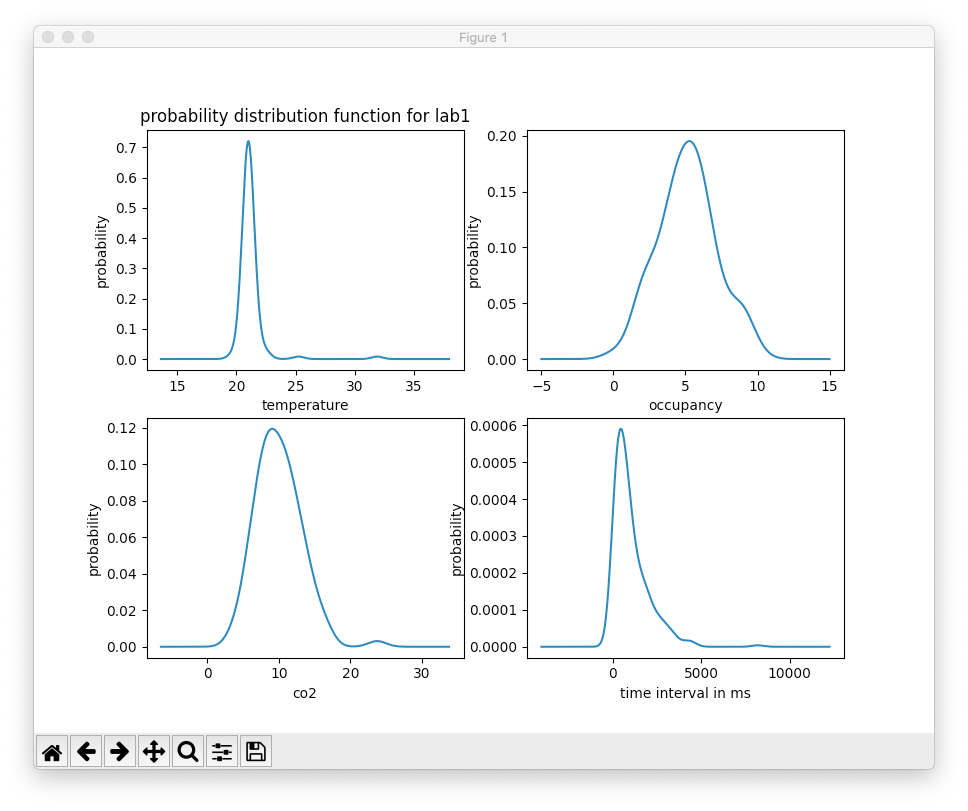

Hongcheng Mao

Zhijun Xiang

Sean McDonald

9/17/2020

ENG EC 463

# Sensor Mini Project

### Overview:

Our project takes simulated sensor data from a Websockets server and client, imports it to a text file and analyses it with Python numeric libraries and our own algorythm.


#### Task 0 
		
This task was to set up the sensor server and client for the simulated sensor to output data to the client in JSON format.
the first greeting string issued by the server to the client upon connecting is:

```sh
ECE Senior Capstone IoT simulator
```

#### Task 1

We imported data from the client in JSON format into a file data.txt using a simple for loop in our analyse.py file. Every new data point fromt the client immidately gets imported into the data.txt file. Heres a snipet of that loop:

```sh
    with open(file, "r") as f:
        for line in f:
            r = json.loads(line)
            room = list(r.keys())[0]
            time = datetime.fromisoformat(r[room]["time"])

            temperature[time] = {room: r[room]["temperature"][0]}
            occupancy[time] = {room: r[room]["occupancy"][0]}
            co2[time] = {room: r[room]["co2"][0]}
         

    data = {
        "temperature": pandas.DataFrame.from_dict(temperature, "index").sort_index(),
        "occupancy": pandas.DataFrame.from_dict(occupancy, "index").sort_index(),
        "co2": pandas.DataFrame.from_dict(co2, "index").sort_index(),
    }

    return data
```


#### Task 2

After getting the data together in a .txt file, we analysed the temperature, time and occupancy using the Python numeric libraries Pandas and Numpy. This is what our code returned for median and variance of the temperature and occupancy data:


```sh
median of temperature in lab1 is: 21.026 

variance of temperature in lab1 is: 1.4438 

median of occupancy in lab1 is: 5.0 

variance of occupancy in lab1 is: 4.0798 
```

After calulating these statistics, we plotted probability density functions for each data type:



Here is the mean and variance of the time intravals:

```sh
the mean of time interval for sensor is: 1026.2ms

the variance of time interval is sensor is: 9.9794e+05
```

#### Task 3

To detect outliers in the temperature sensor data, we created an algorithm. There were no data points greater than 2 standard deviations away from the mean, so we considered everything outside of one standard deviation to be an outlier. Here is what our code returned for the percentage of bad data points and the new median and varience without them:

```sh
Considering the data point ONE standard away mean as bad data point, then:
the percentage of bad lab1 temperature data points: 0.05

after removing the abnormal (1 standard deviation away mean), the median is: 21.022
 
after removing the abnormal (1 standard deviation away mean), the variance is: 0.059677
```

Based on the possible standard deviations, we calculated the possible temperature bounds for each room:

```sh
according to the data point collected and considering temperature in 3 standard deviation away the mean are possible, then:
the possible bounds on temperature for lab1 is from 17.5799 to 24.7894

the possible bounds on temperature for office is from 18.0107 to 28.7376

the possible bounds on temperature for class1 is from 24.5638 to 29.7993

for lab1, if removed the abnormal temperature(1 standard deviation away mean), the possible of temperature is from 20.2994 to 21.7651
```


